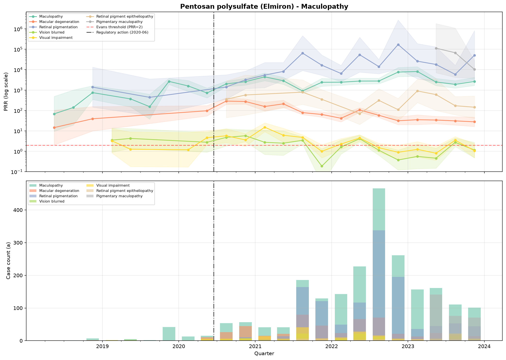
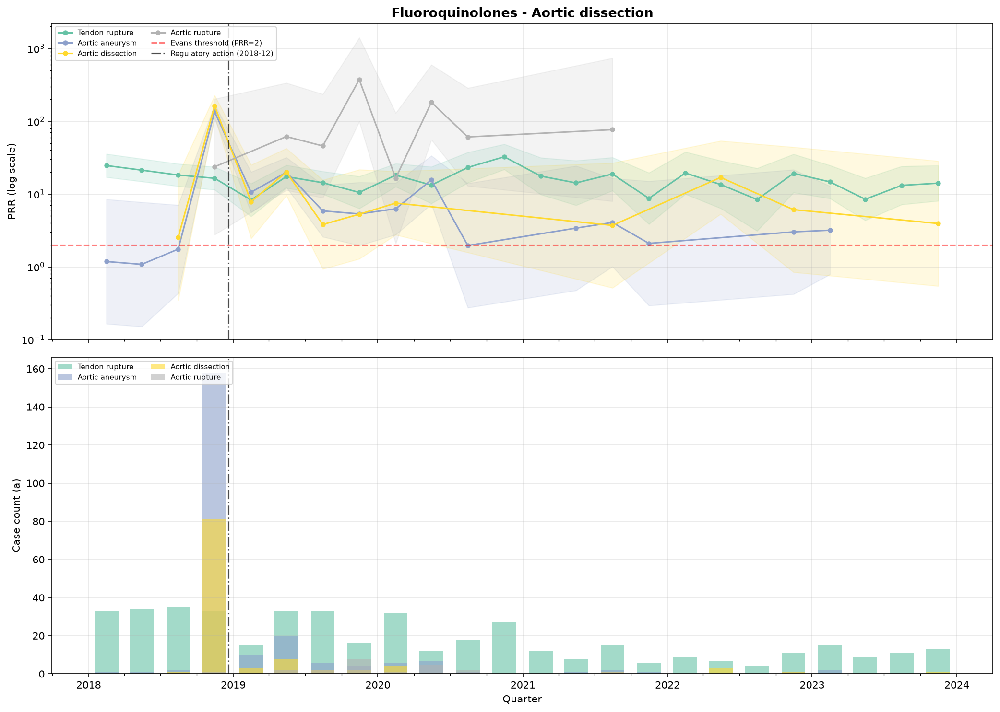
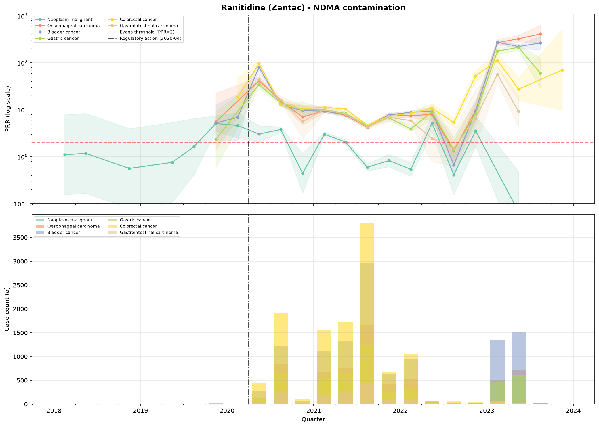

# Drug Safety Signal Detection from FDA Adverse Event Data

> **Core Research Question**: How early and how reliably do statistical disproportionality signals (PRR/ROR) appear in FDA FAERS data for drugs that were later subject to regulatory action and what are the primary sources of estimate instability and potential confounding?

[](https://www.python.org/)
[](LICENSE)
[-green.svg)](https://fis.fda.gov/extensions/FPD-QDE-FAERS/FPD-QDE-FAERS.html)
[]()

---

## Executive Summary

* **Objective**: Retrospectively investigate whether statistical signal detection methods (Proportional Reporting Ratio and Reporting Odds Ratio) detect safety signals in spontaneous reporting data before official FDA regulatory actions and quantify sources of reporting noise.
* **Scale**: Processed **24 quarters** (2018 Q1 – 2023 Q4) of raw FDA FAERS data (~400K reports/quarter, **7.75M+ drug-reaction pairs**).
* **Methods**: Evans criteria disproportionality ($PRR \ge 2$, $\chi^2 \ge 4$, $a \ge 3$) with 95% log-normal confidence intervals; quarterly temporal tracking; negative-control sensitivity; and reporting-volume analysis.
* **Key Finding**: Signals were retrospectively observable prior to regulatory action dates for well-characterized safety events (e.g., 19 months prior for pentosan-induced maculopathy).
* **Critical Limitations**: Spontaneous reporting lacks an exposure denominator; 40% of Evans signals stem from small case counts ($a=3\text{--}4$); stimulated reporting surges post-action (~3.3x for ranitidine); and negative controls also yield persistent signals, demonstrating that disproportionality indicates statistical association rather than clinical causality.

---

## Case Study Summary & Hierarchy

The 5 case studies are explicitly divided into **primary** (well-defined clinical outcomes) and **caveated** (product-quality reporting or pre-existing background risk):

| Category | Drug | Adverse Event / Reaction | FDA Regulatory Action | Action Date | First Observable Signal | Observable Window | Peak PRR |
|---|---|---|---|---|---|---|---|
| **Primary** | **Pentosan (Elmiron)** | Retinal pigmentation / Maculopathy | Label warning for retinal damage | 2020-06 | 2018Q4 | **19 months before action** | 171,239.6 |
| **Primary** | **Fluoroquinolones** | Aortic dissection / rupture | Safety communication on aortic risks | 2018-12 | 2018Q1 *(earliest quarter)* | **≥10 months (left-censored)** | 373.6 |
| **Primary** | **Ranitidine (Zantac)** | Oesophageal / gastric carcinoma | Market withdrawal request | 2020-04 | 2019Q3 | **8 months before action** | 412.5 |
| *Caveated* | *Valsartan* | Product contamination / quality issue | Voluntary recall (NDMA impurity) | 2018-07 | 2018Q2 | ~2 months before action | 76.1 |
| *Caveated* | *Metformin* | Lactic acidosis (pre-existing risk) | Investigation of NDMA impurity | 2020-05 | 2018Q1 *(earliest quarter)* | ≥27 months (left-censored) | 223.6 |

*All observations are retrospective. Case-study drugs were selected because their regulatory actions are already known. This analysis does not demonstrate prospective predictive capability.*

---

## Key Results & Visual Evidence

### 1. Primary Case Study: Pentosan Polysulfate (Elmiron) & Maculopathy
* **Context**: FDA added a warning regarding pigmentary maculopathy and irreversible retinal damage in June 2020.
* **Finding**: Evans criteria signals for retinal pigmentation and maculopathy were detectable from **2018Q4**, providing an observable retrospective window of **19 months** prior to the label warning with PRR exceeding $10^4$.



---

### 2. Primary Case Study: Fluoroquinolones (Levofloxacin) & Aortic Dissection
* **Context**: FDA issued a safety communication warning of increased aortic aneurysm and dissection risks in December 2018.
* **Finding**: Signals for aortic rupture and dissection were present in **2018Q1** (the earliest quarter in our dataset), yielding a lower-bound observable window of **$\ge$10 months**. Because the signal was present in the earliest quarter, true onset is left-censored and predates our observation window.



---

### 3. Primary Case Study: Ranitidine (Zantac) & Post-Action Reporting Surge
* **Context**: FDA requested complete market withdrawal of ranitidine in April 2020 due to NDMA impurity.
* **Finding**: Disproportionality for gastrointestinal malignancies emerged in **2019Q3** (8 months before withdrawal). Post-action data clearly illustrates **stimulated reporting**: adverse event reporting surged post-withdrawal, with total Evans signal pairs increasing **~3.3x** and distinct reported reactions increasing **1.5x**.



---

### 4. Caveated Case Studies
* **Valsartan**: While a signal appeared in 2018Q2 (~2 months prior to the July 2018 recall), the MedDRA term driving the signal was *"Product contamination"* (a reporting term reflecting initial recall news) rather than an emerging clinical adverse reaction.
* **Metformin**: The FDA investigated NDMA in metformin in May 2020. However, disproportionality analysis is dominated by *lactic acidosis* (PRR = 223.6), a well-characterized, boxed-warning side effect documented for decades. Metformin did not exhibit an independent NDMA-related cancer signal and is retained solely for reporting transparency.

---

### 5. Signal Reliability & Negative Controls
* **Low Case Count Instability**: **39.6%** of all Evans signals rely on only $a=3$ or $a=4$ reports. While potentially legitimate early indicators, point estimates at low counts exhibit wide confidence intervals and high variance.
* **Negative Controls**: Three widely-prescribed medications without major safety actions in 2018–2024 (**levothyroxine**, **omeprazole**, **amlodipine**) were evaluated across all 24 quarters. All three generated persistent Evans signals in **24/24 quarters** (signal rates 5.1%–7.6%). This proves that disproportionality alone does not indicate an actionable safety risk without rigorous clinical adjudication.

---

## Dataset & Reproducibility Architecture

### Data Source & Storage Policy
* **Source**: Official [FDA Adverse Event Reporting System (FAERS)](https://fis.fda.gov/extensions/FPD-QDE-FAERS/FPD-QDE-FAERS.html) Quarterly Data Extracts.
* **Coverage**: 2018 Q1 through 2023 Q4 (24 analyzed quarters).
* **Storage Policy**: Raw FAERS extracts (~1.5 GB compressed) and intermediate cached tables are **intentionally excluded from Git** via `.gitignore` to maintain repository hygiene.
* **Automated Data Retrieval**: The entire pipeline fetches data directly from the official FDA public endpoints on demand and maintains local cache files in `data/processed/`.

### Setup Instructions

```bash
# 1. Clone repository
git clone https://github.com/mohana-kamineni/faers-signal-detection.git
cd faers-signal-detection

# 2. Create and activate virtual environment
python -m venv .venv
# On Windows:
.venv\Scripts\activate
# On Linux/macOS:
source .venv/bin/activate

# 3. Install dependencies
pip install -r requirements.txt
```

### Execution Pipeline

```bash
# Step 1: Download raw FAERS quarterly archives and process disproportionality
# Downloads raw data from FDA servers, cleans, and computes quarterly PRR/ROR tables.
python src/pipeline.py

# Step 2: Run retrospective temporal analysis on case-study drugs
# Extracts quarterly trajectories and generates case-study timelines in figures/.
python src/temporal.py

# Step 3: Run signal reliability, stimulated reporting, and negative-control analysis
# Generates noise and negative-control figures in figures/ and output summaries.
python src/noise_analysis.py
```

*Note: The pipeline employs local caching. Once a quarter is processed into `data/processed/signals_<quarter>.csv`, subsequent runs read from disk.*

---

## Repository Structure

```
faers-signal-detection/
├── figures/                              # Generated visual evidence & summaries
│   ├── case_study_summary.csv            # Summary metrics across all case studies
│   ├── findings_summary.txt              # Formal findings report
│   ├── noise_case_count.png              # Case count distribution vs. PRR stability
│   ├── noise_stimulated_reporting.png    # Post-action reporting volume visualization
│   ├── noise_top_drugs.png               # Top signal-generating drugs
│   ├── timeline_pentosan_polysulfate_elmiron.png
│   ├── timeline_fluoroquinolones.png
│   ├── timeline_ranitidine_zantac.png
│   ├── timeline_valsartan.png
│   └── timeline_metformin.png
├── src/                                  # Modular analytical pipeline
│   ├── __init__.py
│   ├── download.py                       # Automated FDA quarterly extract downloader
│   ├── ingest.py                         # Parsing $-delimited ASCII tables (DEMO, DRUG, REAC)
│   ├── clean.py                          # Deduplication, prod_ai normalization, suspect filtering
│   ├── detection.py                      # 2x2 contingency table, PRR, ROR, chi2, Evans criteria
│   ├── pipeline.py                       # Multi-quarter batch orchestrator with caching
│   ├── temporal.py                       # Longitudinal trajectory tracking & observation windows
│   └── noise_analysis.py                 # Reliability, stimulated reporting, negative controls
├── .gitignore                            # Excludes raw data, cache, and virtual environments
├── LICENSE                               # MIT License
├── README.md                             # Project overview and recruiter documentation
└── requirements.txt                      # Minimum pinned dependency versions
```

---

## Statistical Methodology

Disproportionality analysis is conducted on $2 \times 2$ contingency tables for each drug-reaction pair in each quarterly snapshot:

| | Target Reaction ($R$) | All Other Reactions ($\neg R$) | Total |
|---|---|---|---|
| **Target Drug ($D$)** | $a$ | $b$ | $a+b$ |
| **All Other Drugs ($\neg D$)** | $c$ | $d$ | $c+d$ |
| **Total** | $a+c$ | $b+d$ | $N$ |

* **Proportional Reporting Ratio (PRR)**:
  $$\text{PRR} = \frac{a / (a+b)}{c / (c+d)}$$
  Standard Error: $\text{SE}(\ln \text{PRR}) = \sqrt{\frac{1}{a} - \frac{1}{a+b} + \frac{1}{c} - \frac{1}{c+d}}$
* **Reporting Odds Ratio (ROR)**:
  $$\text{ROR} = \frac{a \cdot d}{b \cdot c}$$
  Standard Error: $\text{SE}(\ln \text{ROR}) = \sqrt{\frac{1}{a} + \frac{1}{b} + \frac{1}{c} + \frac{1}{d}}$
* **Yates-Corrected Chi-Squared ($\chi^2$)**:
  $$\chi^2 = \frac{N \left( |a \cdot d - b \cdot c| - \frac{N}{2} \right)^2}{(a+b)(c+d)(a+c)(b+d)}$$
* **Evans Criteria for Signal Detection**:
  $$\text{PRR} \ge 2.0 \quad \land \quad \chi^2 \ge 4.0 \quad \land \quad a \ge 3$$

---

## Methodological Limitations

1. **Spontaneous Reporting Constraints**: FAERS reports are submitted voluntarily by clinicians, consumers and manufacturers. Reports lack medical verification and cannot prove causality.
2. **Absence of Exposure Denominator**: FAERS records adverse events, not prescription rates or patient-years. Disproportionality measures relative reporting frequency, not absolute incidence.
3. **Multiple Comparisons**: Tens of thousands of drug-reaction pairs are evaluated each quarter without family-wise error rate or false discovery rate corrections. Disproportionality operates as a high-sensitivity screening filter, not a definitive statistical test.
4. **Left-Censoring**: For signals present in the initial observation quarter (2018Q1), the true onset of disproportionality is unknown and predates the dataset.
5. **Cross-Quarter Deduplication**: Deduplication is performed within each quarterly file (retaining the latest `caseversion` per `caseid`). Updated case records spanning multiple quarters may appear across successive quarters.
6. **Drug Normalization Imperfections**: While active ingredient mapping (`prod_ai`) standardizes 98.2% of suspect records, 1.8% fall back to cleaned verbatim trade names.

---

## License

This project is licensed under the MIT License — see the [LICENSE](LICENSE) file for details.

## Technologies Used

* **Python 3.10+**
* **Data Processing**: `pandas`, `numpy`, `scipy`
* **Visualization**: `matplotlib`, `seaborn`
* **Networking**: `requests`
